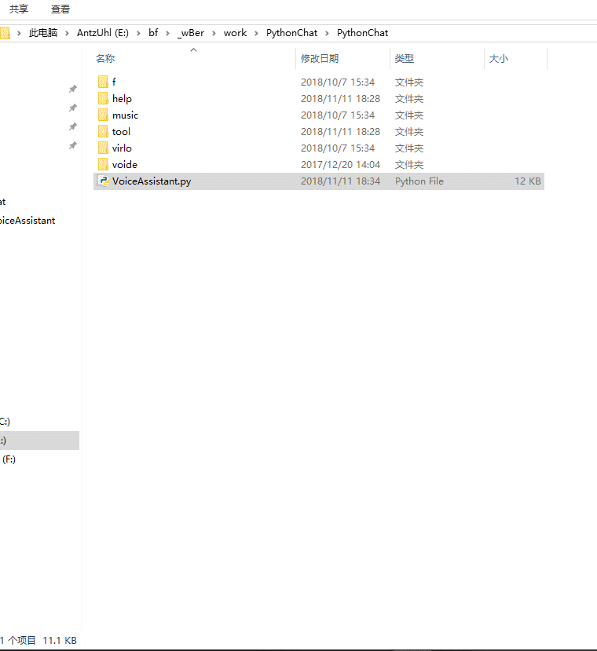
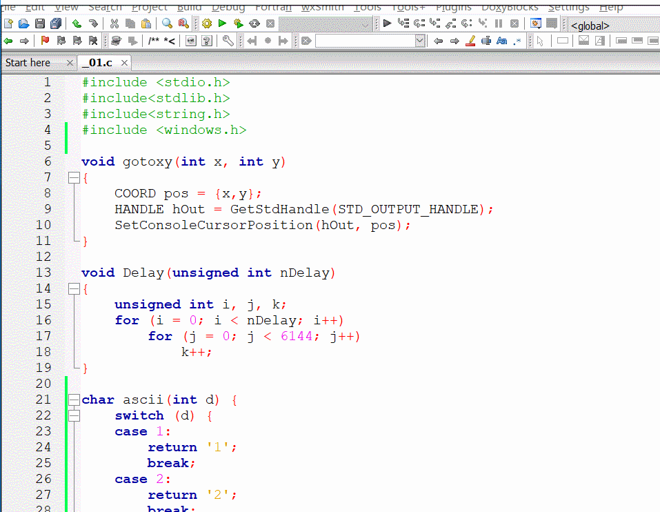

# python-VoiceAssistant
:stuck_out_tongue_winking_eye::stuck_out_tongue_winking_eye: python开发的基于Windows平台API语音接口的语音管家。


###### 欢迎关注公众号，开启和我的交流


### 功能

* 语音回答
* 启动动画
* 跳舞
* 点歌
* 天气查询
* 翻译
* 点播/随机播放鬼畜视频
* 本机自损(释放病毒)

### 运行效果：

#### 因为下面截取的是gif文件，所以无法听到声音。

#### * 启动动画+对话效果



#### * 单步跳舞效果



#### * Windows语音api

```
  ('mshta vbscript:createobject("sapi.spvoice").speak("Apagando las luces")(window.close)')
```
